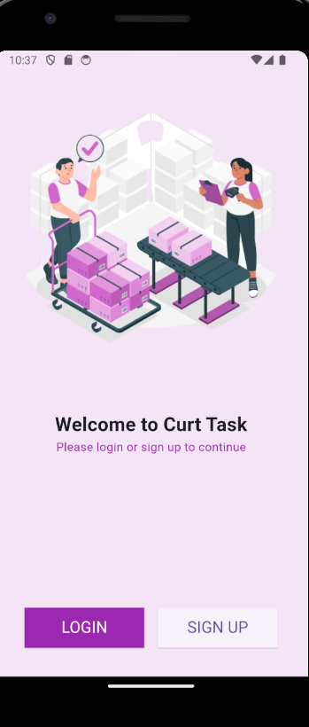
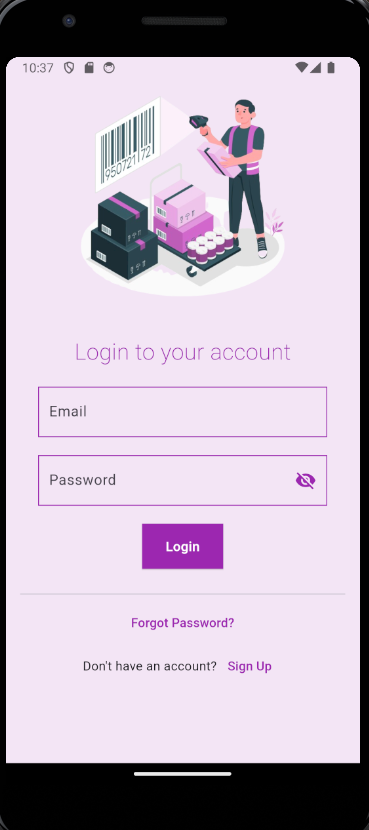
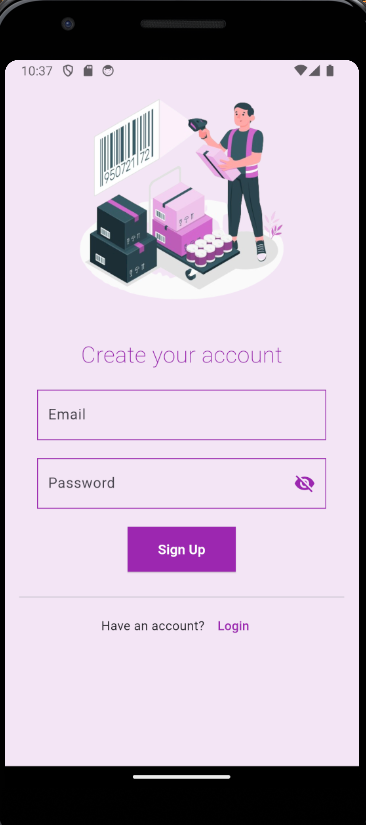
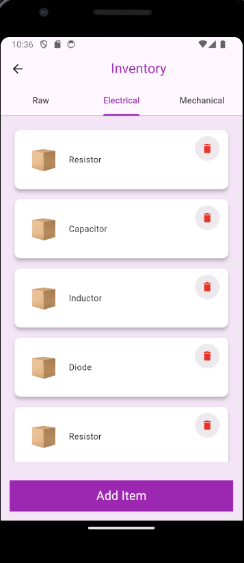
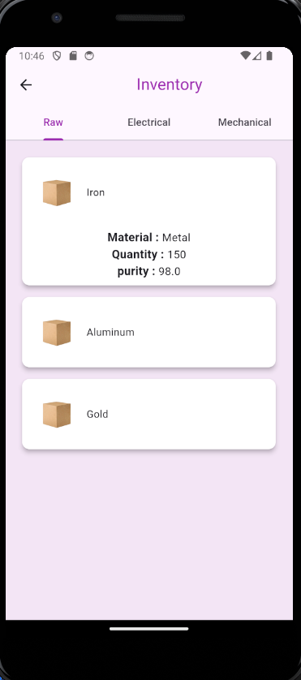
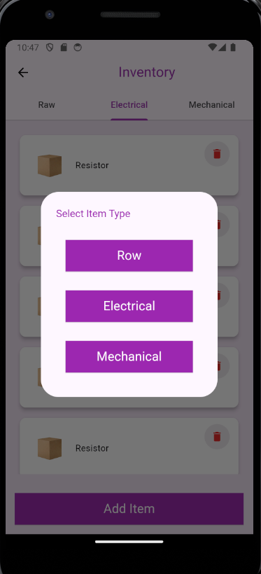
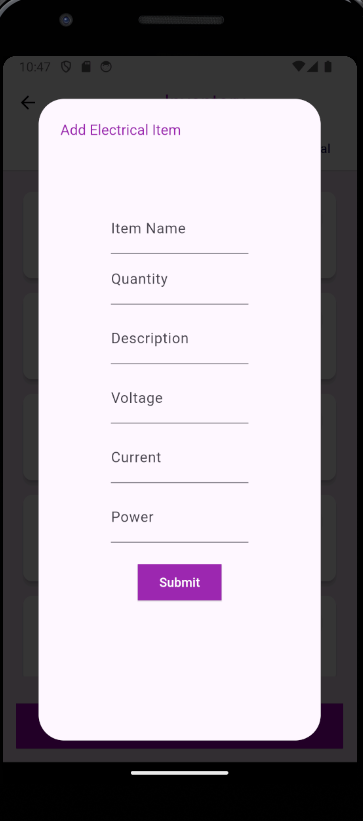
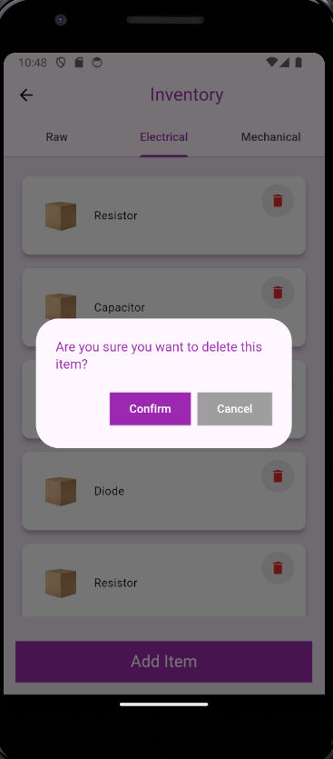

# 📦 Inventory Management System Task

## Project Overview
This project is an Inventory Management System with user authentication and authorization. The system allows users to add, view, edit, and delete inventory items based on their roles (admin or regular user).

## Features

- 🔐 User Authentication (Login and Sign Up)
- 🛡️ Role-based Authorization (Admin and Regular User)
- 📝 Add, View, Edit, and Delete Inventory Items
- 🏗️ Clean Code Architecture with Data, Domain, and Presentation Layers
- 🖥️ Backend implemented with Node.js and Express.js
- 🗄️ PostgreSQL Database Integration
- 📱 Frontend implemented with Flutter

## Frontend

### Flutter


The frontend of this project is implemented using Flutter. Flutter is an open-source UI software development toolkit created by Google. It is used to develop applications for Android, iOS, Linux, Mac, Windows, Google Fuchsia, and the web from a single codebase.

### Important Packages Used

- `flutter_bloc`: For state management using the BLoC pattern.
- `dio`: For making HTTP requests.
- `equatable`: For value equality.
- `flutter_secure_storage`: For secure storage of tokens and other sensitive data.

### Project Structure

### Clean Code Architecture

The project follows the Clean Code Architecture, which divides the project into three main layers:

- **Data Layer**: Handles data fetching and storage.
- **Domain Layer**: Contains business logic.
- **Presentation Layer**: Manages the UI and user interaction.

### Frontend Setup

1. Install Flutter dependencies:

    ```sh
    cd frontend
    flutter pub get
    ```

2. Run the Flutter application:

    ```sh
    flutter run
    ```

## Backend

### Node.js and Express.js


The backend of this project is implemented using Node.js and Express.js. The backend handles user authentication, authorization, and inventory management.

### API Endpoints

#### Authentication

- **Sign Up**: [`POST /auth/register`]
- **Login**: [`POST /auth/login`]

#### Inventory

- **Get Items**: [`GET /inventory/items/:type`]
- **Add Item**: [`POST /inventory/items`]
- **Delete Item**: [`DELETE /inventory/items/delete`]

### Backend Setup

1. Clone the repository:

    ```sh
    git clone <repository-url>
    cd <repository-directory>
    ```

2. Install backend dependencies:

    ```sh
    cd server
    npm install
    ```

3. Set up PostgreSQL database:
    - Create a new PostgreSQL database.
    - Update the database configuration in [`server/config/db.js`]

4. Run the backend server:
    ```sh
    npm start
    ```

## Setup Instructions

### Prerequisites

- Node.js
- PostgreSQL
- Flutter SDK

## Screenshots

<div>
  
  
  
  
</div>

<div >
  
  
  
  
</div>